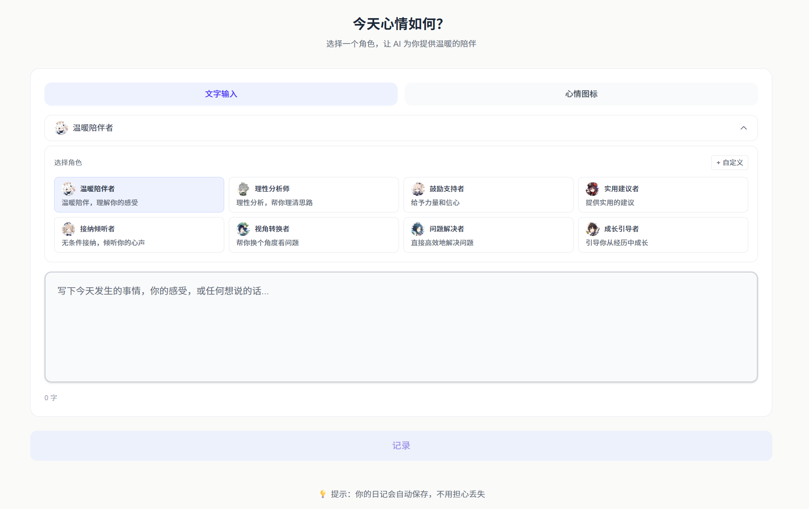
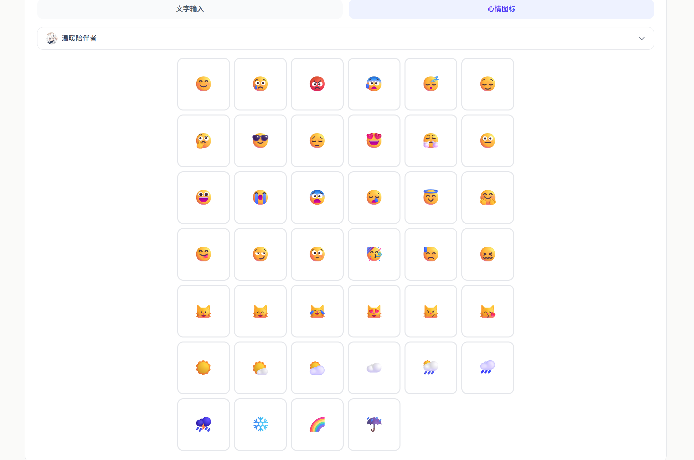
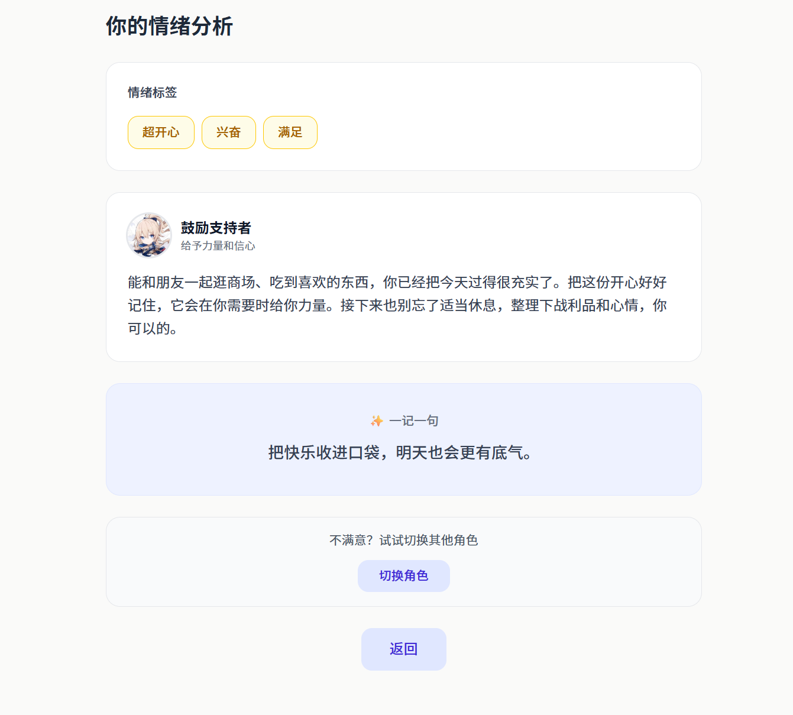
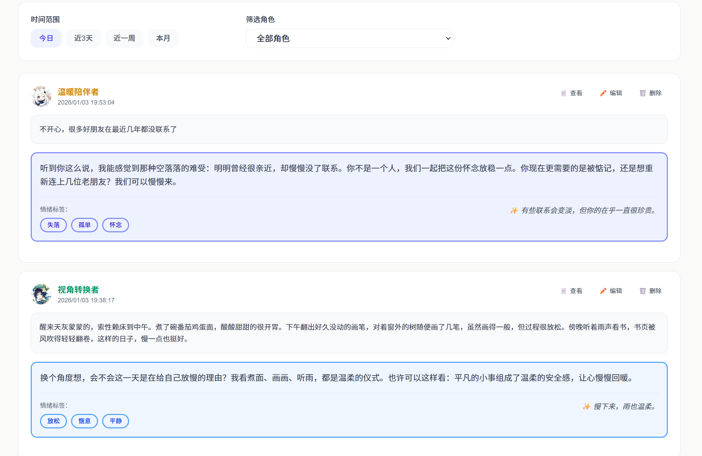
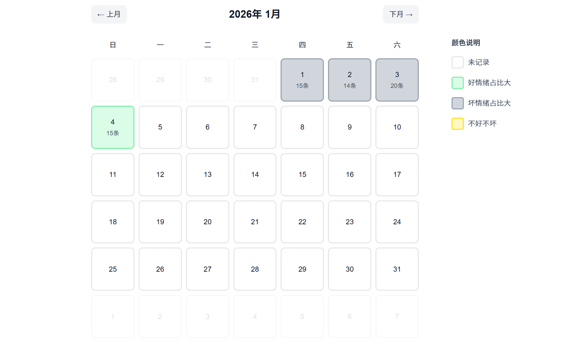
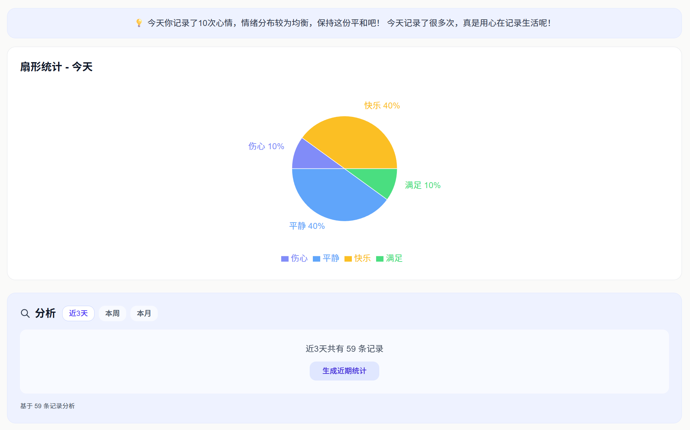
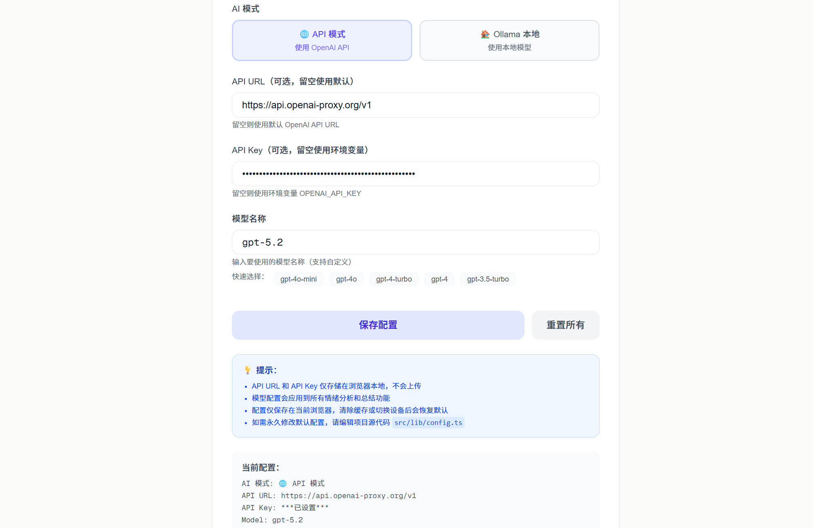
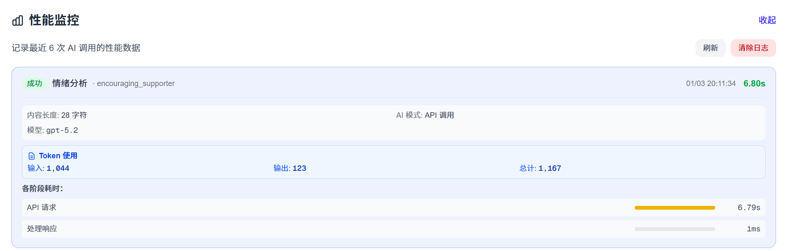

# Mood Mirror

> 一个基于 AI 的个性化情绪日记应用，通过多维度认知角色陪伴你记录心情，深入了解自己的情绪模式。

## ✨ 核心功能

### 🎭 多维度认知角色系统
- **8 种固定角色**：从不同认知维度理解你的情绪（存在主义、行为主义、认知心理学等）
- **自定义角色**：创建专属于你的陪伴者，支持自定义头像和回应风格
- **角色切换重分析**：同一情绪，不同角度的理解

### 📝 灵活记录方式
- **文字输入**：详细记录心情碎碎念
- **心情图标**：快速选择表情，AI 智能分析
- **角色选择**：每次记录可选择不同角色获得个性化反馈

### 📊 强大的数据可视化
- **日历视图**：一览全月情绪分布（绿/灰/黄/白色标记）
- **线性统计**：情绪趋势变化（日/周/月切换）
- **扇形统计**：情绪占比分析（日/周/月切换）
- **数据洞察**：基于数据的智能分析和温馨提示

### 🤖 双模式 AI 支持
- **OpenAI API**：支持 GPT-4o-mini 等在线模型
- **Ollama 本地**：支持本地部署模型，数据更安全
- **性能监控**：实时查看耗时和 Token 使用量

### 🔒 隐私优先设计
- **零服务器存储**：所有数据仅存储在浏览器本地
- **数据导出**：支持 JSON 和 Markdown 格式备份
- **完全可控**：随时导入/导出/清除数据

### 🎯 其他特性
- **历史管理**：查看、编辑、删除历史记录，支持筛选和搜索
- **情绪标签**：AI 自动生成可编辑的情绪标签
- **一记一句**：每次记录附带温暖的名言或原创话语
- **首次引导**：动态引导页面，快速上手
- **响应式设计**：完美适配桌面端和移动端

## 📸 界面预览

### 记录心情

<table>
  <tr>
    <td width="50%">
      
      <p align="center"><em>文字输入模式</em></p>
    </td>
    <td width="50%">
      
      <p align="center"><em>心情图标模式</em></p>
    </td>
  </tr>
</table>

### AI 反馈与分析

<div align="center">
  
  <p><em>个性化 AI 反馈卡片</em></p>
</div>

### 历史管理

<div align="center">
  
  <p><em>历史记录管理 - 筛选、编辑、删除</em></p>
</div>

### 数据统计与洞察

<table>
  <tr>
    <td width="50%">
      
      <p align="center"><em>日历视图与线性统计</em></p>
    </td>
    <td width="50%">
      
      <p align="center"><em>扇形统计与数据洞察</em></p>
    </td>
  </tr>
</table>

### 调试与性能监控

<table>
  <tr>
    <td width="50%">
      
      <p align="center"><em>AI 模型配置</em></p>
    </td>
    <td width="50%">
      
      <p align="center"><em>性能监控与调试日志</em></p>
    </td>
  </tr>
</table>

## 快速开始

### 环境要求

- Node.js 18+
- npm / yarn / pnpm

### 安装步骤

1. **克隆项目**

```bash
git clone https://github.com/Limitinfinitude/A4.git
cd mood-mirror
```

2. **安装依赖**

```bash
npm install
```

3. **配置环境变量**

在项目根目录创建 `.env.local` 文件（可选）：

```env
# OpenAI API 配置（可选，也可以在调试页面配置）
OPENAI_API_KEY=your_openai_api_key_here
```

> 💡 提示：也可以不设置环境变量，直接在应用的调试页面（输入密码 `12345678`）中配置 API Key 和模型。

4. **启动开发服务器**

```bash
npm run dev
```

访问 [http://localhost:3000](http://localhost:3000) 即可使用。

## 🚀 使用说明

### 配置 AI 模型

进入调试页面（侧边栏 → 调试，密码：`12345678`）：

**方式一：使用 OpenAI API**
1. 输入 API Key 和 API URL（可选）
2. 选择模型（默认 `gpt-4o-mini`）
3. 点击保存

**方式二：使用 Ollama 本地模型**
1. 安装并启动 [Ollama](https://ollama.ai)
2. 切换到 Ollama 模式
3. 检测连接并选择已下载的模型
4. 点击保存

### 记录心情

1. 在首页选择记录方式（文字/图标）
2. 选择陪伴角色（可选，默认温暖陪伴者）
3. 输入内容或选择心情图标
4. 点击记录，等待 AI 反馈

### 查看统计

进入统计页面查看：
- **日历视图**：查看全月情绪分布
- **线性统计**：情绪趋势变化
- **扇形统计**：情绪占比分析
- **AI 分析**：生成近期情绪总结

### 管理数据

在设置页面可以：
- 导出数据（JSON/Markdown 格式）
- 导入历史数据
- 管理自定义角色
- 清除所有数据

## 🛠️ 技术栈

- **框架**: Next.js 16.1.1 (App Router)
- **语言**: TypeScript 5
- **UI**: React 19 + Tailwind CSS 4
- **AI**: OpenAI API / Ollama 本地模型
- **图表**: Recharts 3.6
- **存储**: localStorage（客户端）

## 📁 项目结构

```
mood-mirror/
├── src/
│   ├── app/                      # Next.js 页面路由
│   │   ├── page.tsx              # 首页（记录心情）
│   │   ├── feedback/             # 反馈页面
│   │   ├── history/              # 历史记录
│   │   ├── summary/              # 统计与洞察
│   │   ├── settings/             # 设置页面
│   │   ├── debug/                # 调试页面（性能监控）
│   │   └── api/                  # API 路由
│   ├── components/               # React 组件
│   │   ├── MainLayout.tsx        # 主布局
│   │   └── PerformanceMonitor.tsx# 性能监控
│   └── lib/                      # AI Agent 核心逻辑
│       ├── analyzeMood.ts        # 情绪分析
│       ├── generateQuote.ts      # 生成一记一句
│       ├── generateSummary.ts    # 生成统计
│       ├── aiClient.ts           # AI 客户端
│       ├── config.ts             # 配置管理
│       └── performanceLogger.ts  # 性能日志
├── public/
│   └── avatars/                  # 角色头像资源
└── screenshots/                  # 项目截图
```

## 🚢 部署

### Vercel（推荐）

1. 将代码推送到 GitHub
2. 在 [Vercel](https://vercel.com) 导入项目
3. 添加环境变量 `OPENAI_API_KEY`（可选）
4. 部署完成

> 💡 提示：不设置环境变量也可以，用户可以在调试页面自行配置。

### 自托管

```bash
# 构建生产版本
npm run build

# 启动生产服务器
npm start
```

### Docker

```bash
docker-compose up -d
```

## 🔧 调试功能

进入调试页面（密码：`12345678`）可以：
- 配置 AI 模型（OpenAI API / Ollama）
- 查看性能监控（耗时分析、Token 使用量）
- 实时日志输出
- 测试 API 连接


## 📄 许可证

MIT License

---

<div align="center">
  
Made with ❤️ using Next.js, OpenAI & Ollama

**[⭐ Star this project](https://github.com/Limitinfinitude/A4)** if you find it helpful!

</div>
