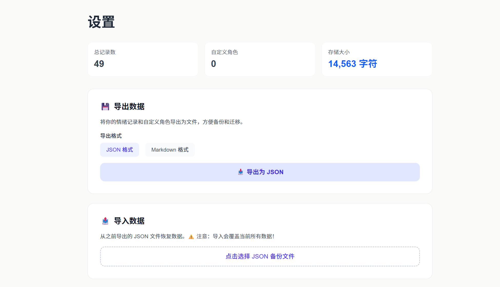

# Mood Mirror

一个基于 AI 的个性化情绪日记应用，帮助你记录心情、获得温暖反馈，并通过数据可视化深入了解自己的情绪模式。

## 功能特性

- 📝 **双模式记录**：文字输入或心情图标快速记录
- 🎭 **8 种 AI 角色**：不同认知维度的陪伴与反馈
- 📊 **数据可视化**：情绪趋势图表和 AI 洞察
- 🔒 **隐私安全**：所有数据存储在本地，零服务器存储
- 📚 **历史管理**：查看、编辑、删除历史记录
- 💾 **数据备份**：支持 JSON/Markdown 导出导入

## 界面预览

<div align="center">
  
  <p><em>首页 - 记录心情</em></p>
</div>

<div align="center">
  
  <p><em>AI 反馈</em></p>
</div>

<div align="center">
  
  <p><em>历史记录</em></p>
</div>

<div align="center">
  
  <p><em>统计与洞察</em></p>
</div>

<div align="center">
  
  <p><em>设置与备份</em></p>
</div>

## 快速开始

### 环境要求

- Node.js 18+
- npm / yarn / pnpm

### 安装步骤

1. **克隆项目**

```bash
git clone https://github.com/Limitinfinitude/A4.git
cd mood-mirror
```

2. **安装依赖**

```bash
npm install
```

3. **配置环境变量**

在项目根目录创建 `.env.local` 文件：

```env
OPENAI_API_KEY=your_openai_api_key_here
OPENAI_MODEL=gpt-4o-mini
```

4. **启动开发服务器**

```bash
npm run dev
```

访问 [http://localhost:3000](http://localhost:3000) 即可使用。

## 技术栈

- **框架**: Next.js 16 (App Router)
- **语言**: TypeScript
- **UI**: React 19 + Tailwind CSS
- **AI**: OpenAI API
- **图表**: Recharts
- **存储**: localStorage

## 项目结构

```
mood-mirror/
├── src/
│   ├── app/              # 页面路由
│   ├── components/        # React 组件
│   └── lib/              # 核心业务逻辑
├── public/
│   └── avatars/          # 角色头像
└── screenshots/          # 项目截图
```

## 部署

### Vercel（推荐）

1. 将代码推送到 GitHub
2. 在 [Vercel](https://vercel.com) 导入项目
3. 添加环境变量 `OPENAI_API_KEY`
4. 部署完成

### Docker

```bash
docker-compose up -d
```

## 许可证

MIT License

---

Made with ❤️ using Next.js and OpenAI
