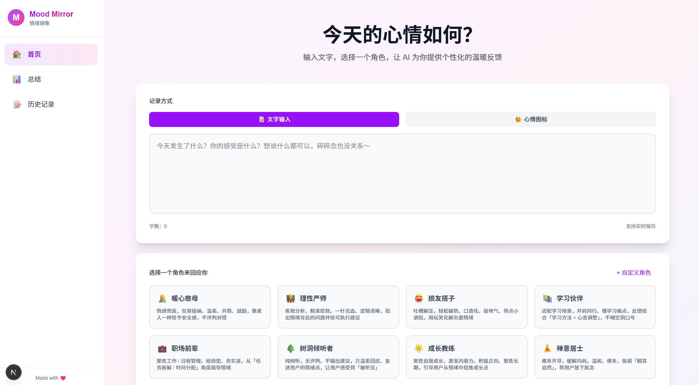
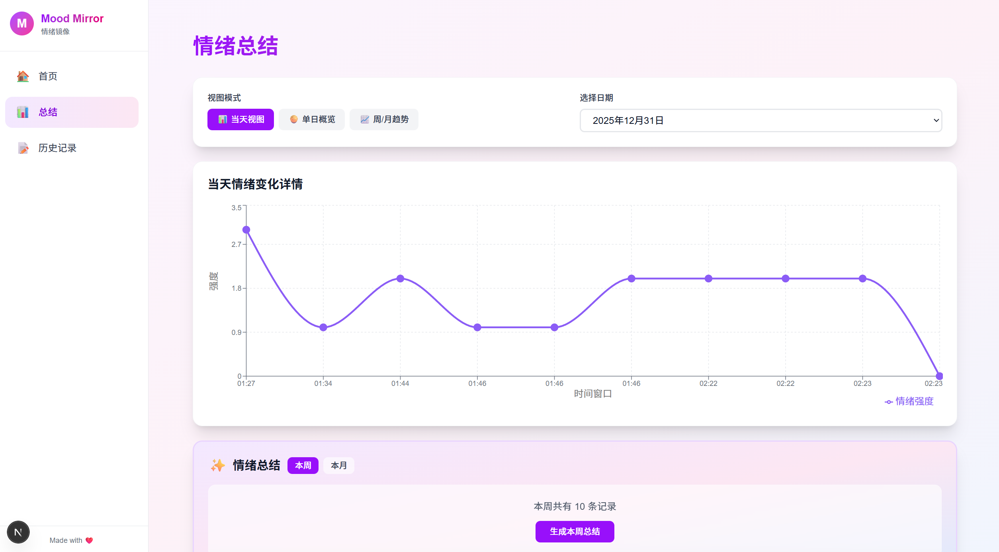
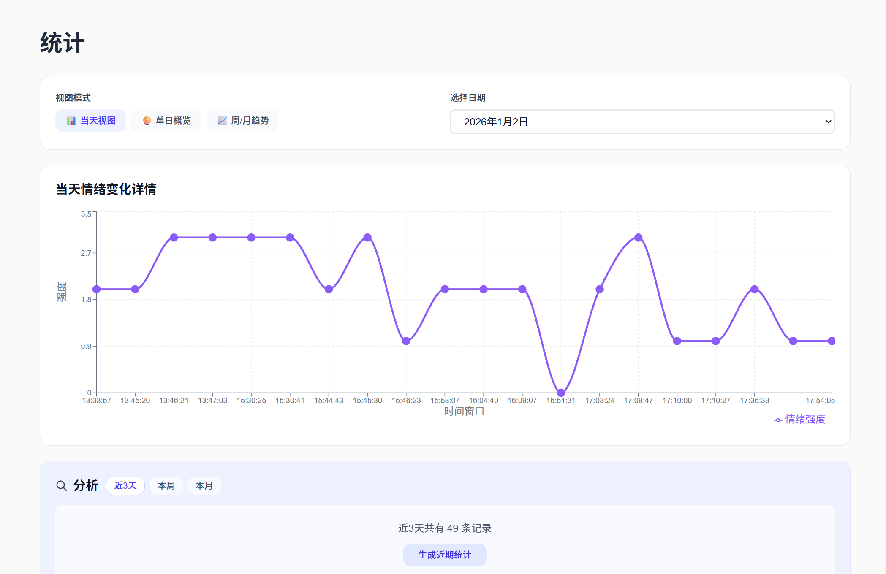
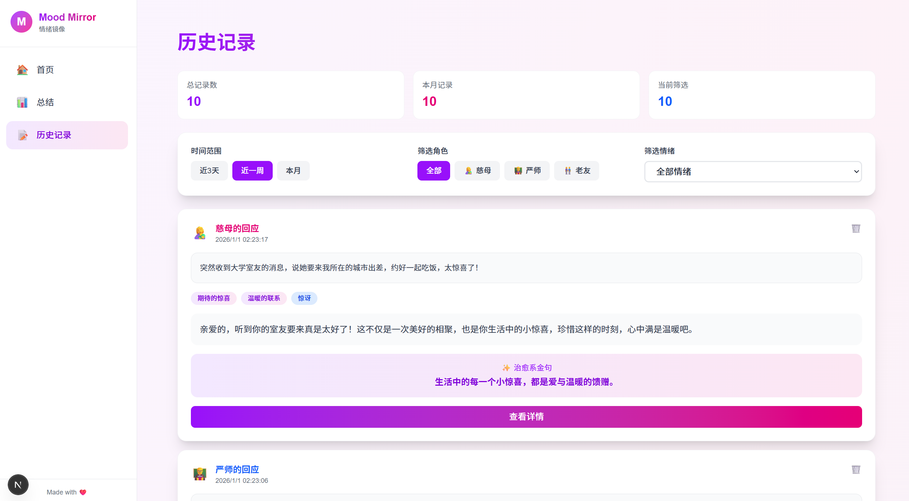

# Mood-Mirror 🌙

一个基于 AI 的个性化情绪日记分析应用，帮助你记录心情、获得温暖反馈，并通过数据可视化深入了解自己的情绪模式。

## ✨ 项目简介

Mood-Mirror 是一个现代化的情绪日记应用，结合了 AI 分析和数据可视化技术。你可以：

- 📝 **记录心情**：支持文字输入或心情图标两种方式记录情绪
- 🤖 **AI 分析**：选择 8 种固定角色或自定义角色获得个性化反馈
- 💬 **快速名言**：图标模式可直接获取温暖的名言金句，无需输入文字
- 📊 **数据可视化**：通过图表了解情绪趋势和模式
- 💡 **智能总结**：AI 自动生成周/月情绪总结，发现情绪规律

所有数据存储在本地（localStorage），保护你的隐私，无需担心数据泄露。

## 📸 界面预览

<div align="center">
  
  <p><em>首页 - 文字记录心情</em></p>
</div>

<div align="center">
  
  <p><em>首页 - 图标记录心情</em></p>
</div>

<div align="center">
  
  <p><em>历史记录与数据可视化</em></p>
</div>

<div align="center">
  
  <p><em>AI 总结与趋势分析</em></p>
</div>

## 🛠️ 技术栈

- **框架**: [Next.js 16](https://nextjs.org/) (App Router)
- **语言**: TypeScript
- **样式**: Tailwind CSS 4
- **AI 模型**: OpenAI GPT-4o-mini
- **数据可视化**: Recharts
- **数据存储**: localStorage（客户端存储）
- **部署**: Vercel（推荐）

## 🎯 核心功能

### 1. 首页 - 记录心情

#### 两种记录方式

**📝 文字输入模式**
- 日记输入框，支持实时保存草稿
- 选择角色获得个性化 AI 反馈
- AI 自动分析情绪，提取潜意识关键词

**😊 心情图标模式**
- 12 种心情图标快速选择（开心、难过、愤怒、焦虑等）
- 无需输入文字，适合不想说话的时候
- 直接获取一句温暖的名言或金句

#### 🎭 角色系统

**8 种固定角色**：
1. **暖心慈母** 🤱：情感兜底，包容接纳。温柔、共情、鼓励，像家人一样给予安全感
2. **理性严师** 👨‍🏫：客观分析，精准提效。一针见血、逻辑清晰，指出问题并给可执行建议
3. **损友搭子** 😄：吐槽解压，轻松破防。口语化、接地气、带点小调侃，用玩笑化解负面情绪
4. **学习伙伴** 📚：适配学习场景，并肩同行。懂学习痛点，反馈结合「学习方法 + 心态调整」
5. **职场前辈** 💼：聚焦工作/日程管理。经验型、务实派，从「任务拆解/时间分配」角度疏导情绪
6. **树洞倾听者** 🌳：纯倾听，无评判。不输出建议，只温柔回应，让用户感受到「被听见」
7. **成长教练** 🌟：聚焦自我成长，激发内驱力。积极正向、聚焦长期，引导用户从情绪中提炼成长点
8. **禅意居士** 🧘：佛系开导，缓解内耗。温和、佛系，强调「顺其自然」，帮用户放下执念

**✨ 自定义角色**：
- 支持创建、编辑、删除自定义角色
- 可自定义角色名称和设定描述
- 完全个性化你的情绪反馈体验

### 2. 反馈页 - AI 分析结果

**文字模式反馈**：
- 🔍 **潜意识情绪关键词**：AI 提取 1-2 个隐藏的情绪关键词
- 🏷️ **情绪标签**：从 12 种内置情绪中自动识别
- 💬 **角色反馈**：根据选择的角色生成 30-50 字的个性化反馈
- 💎 **治愈系金句**：一句温暖治愈的话语

**图标模式反馈**：
- 💬 **名言金句**：根据选择的心情图标，生成一句温暖的名言或金句
- 可以是经典名言、诗句，或原创的温暖话语

### 3. 历史记录页

- 📚 查看所有历史记录（文字和图标记录）
- 🗓️ 时间筛选：支持查看近 3 天/本周/本月的记录
- 🔍 显示原始日记内容或心情图标
- 🎭 按角色筛选记录
- 🏷️ 按情绪标签筛选记录
- 🗑️ 支持删除单条记录或清空所有记录

### 4. 总结页 - 数据可视化与 AI 总结

#### 📊 三种视图模式

1. **当天视图（Detail View）**
   - 折线图展示单日情绪强度变化
   - X 轴：时间窗口
   - Y 轴：情绪强度
   - Tooltip 显示主导情绪

2. **单日概览**
   - 饼图展示单日情绪分布占比
   - 直观了解一天中的情绪构成

3. **周/月趋势**
   - 折线图展示多日情绪趋势
   - X 轴：日期
   - Y 轴：平均情绪强度
   - 线条颜色表示每日主导情绪

#### ✨ AI 智能总结

- 📅 支持生成**本周**或**本月**的情绪总结
- 📈 总结内容包括：
  - **情绪走向**：最常出现的情绪、情绪分布、强度趋势、工作日/周末差异
  - **关键词回顾**：你经常提到的关键词和典型句子
- 🎯 只提供观察，不提供建议，专业且温暖

## 🚀 快速开始

### 环境要求

- Node.js 18+ 
- npm / yarn / pnpm

### 安装步骤

1. **克隆项目**

```bash
git clone <your-repo-url>
cd mood-mirror
```

2. **安装依赖**

```bash
npm install
# 或
yarn install
# 或
pnpm install
```

3. **配置环境变量**

在项目根目录创建 `.env.local` 文件：

```env
OPENAI_API_KEY=your_openai_api_key_here
```

> 💡 获取 OpenAI API Key：
> 1. 访问 [OpenAI Platform](https://platform.openai.com/)
> 2. 注册/登录账号
> 3. 进入 API Keys 页面创建新密钥
> 4. 将密钥复制到 `.env.local` 文件中

4. **启动开发服务器**

```bash
npm run dev
# 或
yarn dev
# 或
pnpm dev
```

5. **打开浏览器**

访问 [http://localhost:3000](http://localhost:3000) 即可使用应用。

### 构建生产版本

```bash
npm run build
npm start
```

## 📁 项目结构

```
mood-mirror/
├── src/
│   ├── app/                    # Next.js App Router 页面
│   │   ├── api/                # API 路由
│   │   │   ├── analyze/        # 情绪分析 API
│   │   │   ├── quote/           # 名言生成 API
│   │   │   └── summary/         # AI 总结 API
│   │   ├── feedback/           # 反馈页
│   │   ├── history/             # 历史记录页
│   │   ├── summary/             # 总结页
│   │   ├── layout.tsx           # 根布局
│   │   └── page.tsx             # 首页
│   ├── components/              # React 组件
│   │   ├── MainLayout.tsx       # 主布局组件
│   │   └── Sidebar.tsx           # 侧边栏导航
│   └── lib/                     # 工具函数
│       ├── analyzeMood.ts       # 情绪分析核心逻辑
│       ├── generateQuote.ts     # 名言生成逻辑
│       ├── generateSummary.ts   # AI 总结生成逻辑
│       ├── iconToEmotion.ts     # 图标到情绪映射
│       ├── customRoles.ts       # 自定义角色管理
│       └── roleUtils.ts         # 角色工具函数
├── public/                      # 静态资源
├── .env.local                   # 环境变量（需自行创建）
├── package.json
└── README.md
```

## 🎨 功能特性

### 内置情绪标签（12 种）

- **正向情绪（4 种）**：
  - 快乐、开心（joy）
  - 满足、认可（satisfaction）
  - 平静、放松（calm）
  - 希望、期待（hope）

- **负向情绪（6 种）**：
  - 伤心、低落（sadness）
  - 愤怒、生气（anger）
  - 焦虑、紧张（anxiety）
  - 恐惧、不安（fear）
  - 挫败、无力（frustration）
  - 疲惫、累（tired）

- **中性/特殊（2 种）**：
  - 惊讶（surprise）
  - 中性、平静无波（neutral）

### 数据存储

- 所有数据存储在浏览器 `localStorage` 中
- 无需后端服务器，零部署成本
- 数据完全本地化，保护隐私

### 响应式设计

- 完美适配 Web 和移动端 H5
- 使用 Tailwind CSS 实现现代化 UI
- 支持深色模式

## 🔧 开发说明

### 技术亮点

1. **Prompt 工程**：精心设计的提示词确保 AI 输出可控，避免"胡说八道"
2. **延迟初始化**：OpenAI 客户端延迟初始化，避免模块加载时的环境变量错误
3. **类型安全**：完整的 TypeScript 类型定义
4. **性能优化**：使用 `useMemo` 优化计算密集型操作

### 自定义配置

- **修改 AI 模型**：在 `src/lib/analyzeMood.ts` 中修改 `model` 参数
- **调整情绪标签**：在 `src/lib/analyzeMood.ts` 中修改 `EMOTION_TAGS`
- **修改总结 prompt**：在 `src/lib/generateSummary.ts` 中调整 prompt 模板

## 📝 使用示例

### 方式一：文字记录

1. **记录心情**
   - 在首页选择"文字输入"模式
   - 输入你的心情日记
   - 选择一个角色（8 种固定角色或自定义角色）
   - 点击"生成情绪镜像"

2. **查看反馈**
   - 查看 AI 分析的情绪关键词和标签
   - 阅读选定角色的个性化反馈
   - 查看治愈系金句

### 方式二：图标记录

1. **快速记录**
   - 在首页选择"心情图标"模式
   - 选择一个心情图标（12 种可选）
   - 点击"记录心情"直接获取名言金句

2. **查看名言**
   - 查看根据心情生成的名言或金句
   - 可以是经典名言、诗句或原创温暖话语

### 数据查看与分析

3. **浏览历史**
   - 在历史记录页查看所有记录
   - 使用时间筛选（3天/周/月）快速定位
   - 按角色或情绪标签筛选

4. **分析趋势**
   - 在总结页切换不同视图模式（当天视图/单日概览/周月趋势）
   - 点击"生成本周/本月总结"获取 AI 分析
   - 查看情绪走向和关键词回顾

## 🚢 部署

### Vercel 部署（推荐）

1. 将代码推送到 GitHub
2. 在 [Vercel](https://vercel.com) 导入项目
3. 在项目设置中添加环境变量 `OPENAI_API_KEY`
4. 部署完成！

### 其他平台

项目可以部署到任何支持 Next.js 的平台：
- Netlify
- Railway
- 自建服务器

## 📄 许可证

MIT License

## 🤝 贡献

欢迎提交 Issue 和 Pull Request！

## 📮 联系方式

如有问题或建议，欢迎通过 Issue 反馈。

---

Made with ❤️ using Next.js and OpenAI
